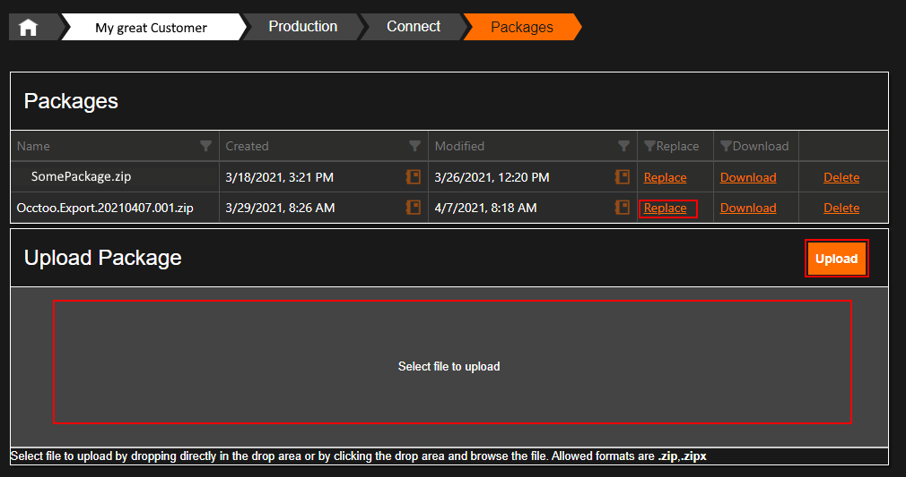

# Introduction 
InRiver extensions to send data over to Occtoo.

* EntityListener - Listens to CRUD events in InRiver and creates a Connector state
* RelationListener - Listens to relation changes and create a Connector state
* SendToOcctooExtension - Picks up the stored Connector states and transforms into documents and sends over to Occtoo
* FullExport - Scheduled extension that only runs when manually triggered to export all data to Occtoo

**NOTE!
This extension is created to be used by many customers so special cases should be placed in ExtractExceptionalFields and controlled via the settings**
---
## How it works
Generic importer is assumed to become universal tool for importing data from inRiver into Occtoo. Basic idea is to control creation of datasources and their structure through json configuration file.

Information on how to create the settings can be found in the [Instructions.docx](./doc/Instructions.docx) documentation. And the Debugger prodject holds a [ClientSettingsExample.cs](src/Occtoo.InRiver.Debugger\Settings\Clients\ClientSettingsExample.cs) file with and example settings setup.

---
## Test
Occtoo.InRiver.Debugger project will test the extensions locally.  
Update the main method with the Extension and customer setting you want to run.

---
## Install
 * Build in Release and create zip package
 * Go to ControlCenter in InRiver and add or replace the package  
 
 * Restart the Extensions service to make the changes take affect

 ---
 ## Contribute
 Pull requests are very welcome.

 Just remember that this is a generic connector that works for many clients so your specific solution might not be something everyone uses, so do not get discouraged if your PR gets rejected.